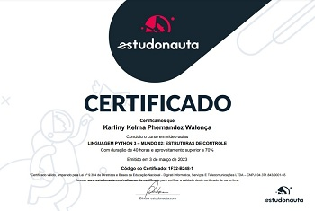

# Exercícios Solucionados 

Compilado de exercícios e respostas em linguagem Python, proposto pelo [Curso em Vídeo](https://www.cursoemvideo.com/). Ministrado pelo professor [Gustavo Guanabara](https://www.instagram.com/gustavoguanabara/).

### Sumário
#### Mundo 2 -

* [Exercício 036](https://github.com/Karliny/python_mundo2_exercicios/blob/master/ex036.py)
* [Exercício 037](https://github.com/Karliny/python_mundo2_exercicios/blob/master/ex037.py)
* [Exercício 038](https://github.com/Karliny/python_mundo2_exercicios/blob/master/ex038.py)
* [Exercício 039](https://github.com/Karliny/python_mundo2_exercicios/blob/master/ex039.py)
* [Exercício 040](https://github.com/Karliny/python_mundo2_exercicios/blob/master/ex040.py)
* [Exercício 041](https://github.com/Karliny/python_mundo2_exercicios/blob/master/ex041.py)
* [Exercício 042](https://github.com/Karliny/python_mundo2_exercicios/blob/master/ex042.py)
* [Exercício 043](https://github.com/Karliny/python_mundo2_exercicios/blob/master/ex043.py)
* [Exercício 044](https://github.com/Karliny/python_mundo2_exercicios/blob/master/ex044.py)
* [Exercício 045](https://github.com/Karliny/python_mundo2_exercicios/blob/master/ex045.py)
* [Exercício 046](https://github.com/Karliny/python_mundo2_exercicios/blob/master/ex046.py)
* [Exercício 047](https://github.com/Karliny/python_mundo2_exercicios/blob/master/ex047.py)
* [Exercício 048](https://github.com/Karliny/python_mundo2_exercicios/blob/master/ex048.py)
* [Exercício 049](https://github.com/Karliny/python_mundo2_exercicios/blob/master/ex049.py)
* [Exercício 050](https://github.com/Karliny/python_mundo2_exercicios/blob/master/ex050.py)
* [Exercício 051](https://github.com/Karliny/python_mundo2_exercicios/blob/master/ex051.py)
* [Exercício 052](https://github.com/Karliny/python_mundo2_exercicios/blob/master/ex052.py)
* [Exercício 053](https://github.com/Karliny/python_mundo2_exercicios/blob/master/ex053.py)
* [Exercício 054](https://github.com/Karliny/python_mundo2_exercicios/blob/master/ex054.py)
* [Exercício 055](https://github.com/Karliny/python_mundo2_exercicios/blob/master/ex055.py)
* [Exercício 056](https://github.com/Karliny/python_mundo2_exercicios/blob/master/ex056.py)
* [Exercício 057](https://github.com/Karliny/python_mundo2_exercicios/blob/master/ex057.py)
* [Exercício 058](https://github.com/Karliny/python_mundo2_exercicios/blob/master/ex058.py)
* [Exercício 059](https://github.com/Karliny/python_mundo2_exercicios/blob/master/ex059.py)
* [Exercício 060](https://github.com/Karliny/python_mundo2_exercicios/blob/master/ex060.py)
* [Exercício 061](https://github.com/Karliny/python_mundo2_exercicios/blob/master/ex061.py)
* [Exercício 062](https://github.com/Karliny/python_mundo2_exercicios/blob/master/ex062.py)
* [Exercício 063](https://github.com/Karliny/python_mundo2_exercicios/blob/master/ex063.py)
* [Exercício 064](https://github.com/Karliny/python_mundo2_exercicios/blob/master/ex064.py)
* [Exercício 065](https://github.com/Karliny/python_mundo2_exercicios/blob/master/ex065.py)
* [Exercício 066](https://github.com/Karliny/python_mundo2_exercicios/blob/master/ex066.py)
* [Exercício 067](https://github.com/Karliny/python_mundo2_exercicios/blob/master/ex067.py)
* [Exercício 068](https://github.com/Karliny/python_mundo2_exercicios/blob/master/ex068.py)
* [Exercício 069](https://github.com/Karliny/python_mundo2_exercicios/blob/master/ex069.py)
* [Exercício 070](https://github.com/Karliny/python_mundo2_exercicios/blob/master/ex070.py)
* [Exercício 071](https://github.com/Karliny/python_mundo2_exercicios/blob/master/ex071.py)

